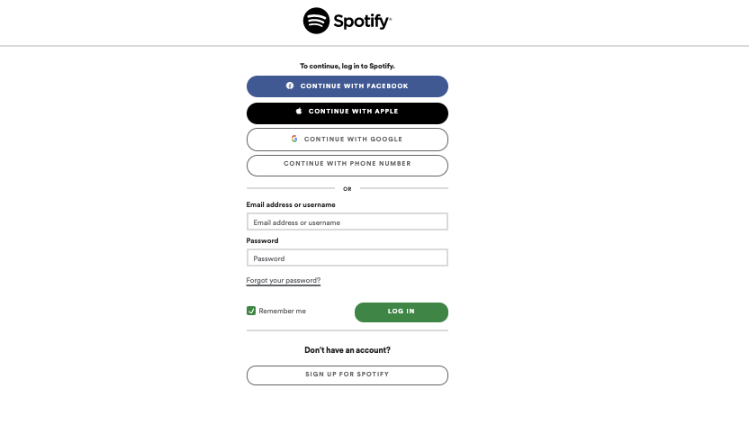
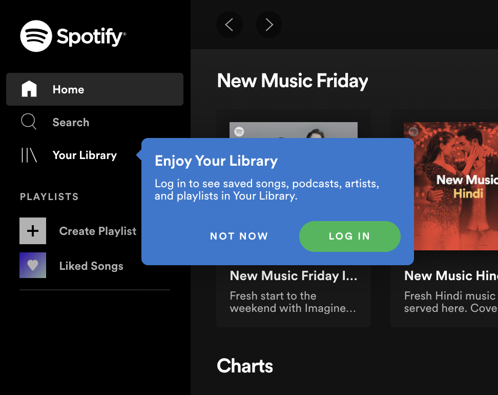

# Day 11

## Spotify: Private routes

- Currently we have the following routes
    - `/albums`: renders all albums
    - `/albums/:id`: renders an individual album with songs
    - `libraries`: renders all playlists of the user
    - `/playlist/:id`: renders individual playlist songs  

All of the above routes are public i.e any user without logging in can access all of these routes    
Lets create authentcation to few of these routes. To do so lets first create `Signin` and `Signup` components which renders in `/signin` and `signup` routes respectively as shown below

- Now create a higher order component called `PrivateRoute` which renders the `Route` component. You can use these components to check if the user is logged in, if so then redirect the user to the respective component.

- Use `PrivateRoute` component for `/libraries` and `playlist/:id` routes i.e user should not access these routes unless they have logged in like shown below.

